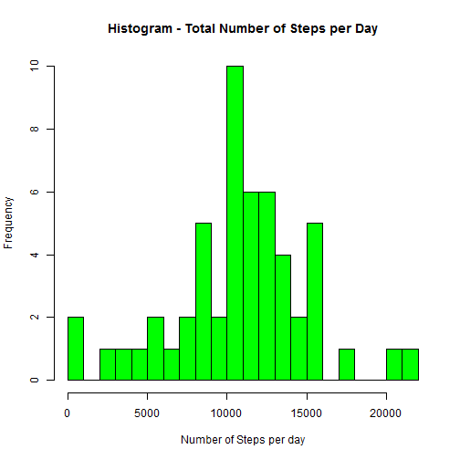
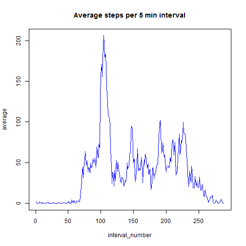
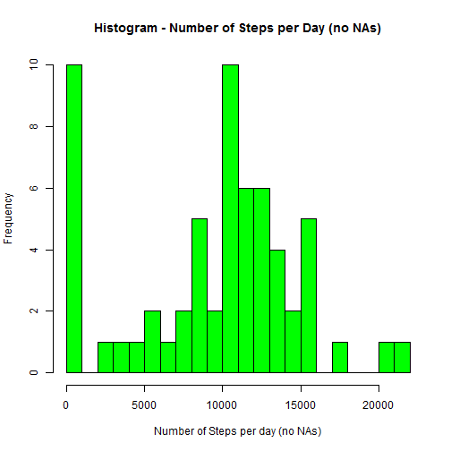
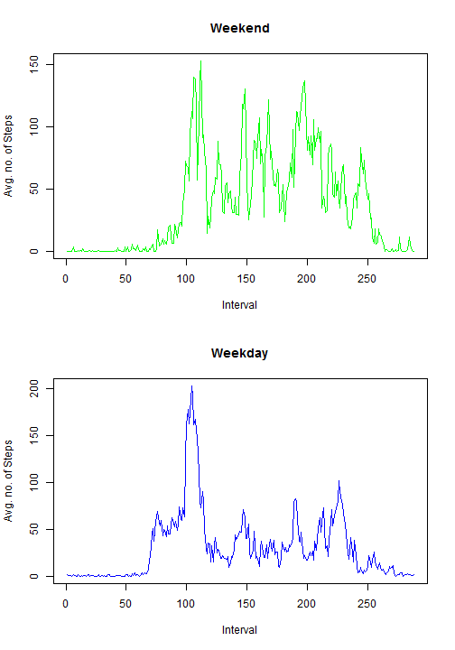

# Reproducible Research - Peer Assessment 1
Graham Robertson


## Introduction
This is the completed assignment that makes use of data from a personal activity monitoring device. 


## Loading and pre-processing the data

After the data file has been unzipped and saved in your working area, load the "activity.csv"" file.

```r
act <- read.csv("activity.csv")
```
For later processing add an interval_number variable. This will be in the range 1:288 equating to the 5 min interval data collection each day.
Sixty one days worth of consecutive data from October to November 2012 is available.

```r
library(dplyr)
act <- mutate(act, interval_number = rep(c(1:288), times = 61))
```

## What is mean total number of steps taken per day?

To calulate the total number of steps taken per day

```r
steps <- act %>%
    group_by(date) %>%
    summarise(total = sum(steps)) %>%
    print
```

```
## Source: local data frame [61 x 2]
## 
##          date total
## 1  2012-10-01    NA
## 2  2012-10-02   126
## 3  2012-10-03 11352
## 4  2012-10-04 12116
## 5  2012-10-05 13294
## 6  2012-10-06 15420
## 7  2012-10-07 11015
## 8  2012-10-08    NA
## 9  2012-10-09 12811
## 10 2012-10-10  9900
## ..        ...   ...
```
Now show as a histogram of the total number of steps taken each day.

```r
hist(steps$total, col = "green", main = "Histogram - Total Number of Steps per Day", xlab = "Number of Steps per day", breaks = 20)
```

 

Calculate and report the mean and median of the total number of steps taken per day.

```r
meanSteps <- mean(steps$total, na.rm = TRUE)
meanSteps
```

```
## [1] 10766.19
```

```r
medianSteps <- median(steps$total, na.rm = TRUE)
medianSteps
```

```
## [1] 10765
```
So we see that the mean value is 10766.19 and the median value is 10765 for the total number of steps per day. 

## What is the average daily activity pattern?
To illustrate the average daily activity pattern create a time series plot (i.e. type = "l") of the 5-minute interval (x-axis) and the average number of steps taken, averaged across all days (y-axis).

```r
timePlot <- act %>%
        group_by(interval_number) %>%
        summarise(average = mean(steps, na.rm = TRUE)) %>%
        print
```

```
## Source: local data frame [288 x 2]
## 
##    interval_number   average
## 1                1 1.7169811
## 2                2 0.3396226
## 3                3 0.1320755
## 4                4 0.1509434
## 5                5 0.0754717
## 6                6 2.0943396
## 7                7 0.5283019
## 8                8 0.8679245
## 9                9 0.0000000
## 10              10 1.4716981
## ..             ...       ...
```

```r
with(timePlot, plot(interval_number, average, type = "l", col = "blue", main = "Average steps per 5 min interval"))
```

 


The 5-minute interval, which on average across all the days in the dataset, contains the maximum number of steps can be determined by:

```r
filter(timePlot, average == max(average))
```

```
## Source: local data frame [1 x 2]
## 
##   interval_number  average
## 1             104 206.1698
```
So we see that interval 104 (08:35 to 08:40) contains the maximum number of steps across all the days in the dataset with an average value of 206 steps.

## Imputing missing values
Calulate the total number of missing values in the dataset and express as a fraction of the total.

```r
sum(!complete.cases(act))
```

```
## [1] 2304
```

```r
sum(!complete.cases(act))/nrow(act)
```

```
## [1] 0.1311475
```
We see that there are 2304 instances of missing values i.e. approximately 13% of the dataset has rows with NAs

### Filling strategy
The strategy employed to fill in the missing data is to create a new dataset by:  
1. Calculating the mean number of steps per day and record in the dataset as a new variable, 'day_mean'   
2. Replace any instances of NAN values this new variable by the overall mean of this new varibale   
3. Replace any instances of NA values in the 'steps' variable by the 'day_mean' value divided by the number of intervals per day (288)  

```r
act2 <- act %>%
        group_by(date) %>%
        mutate(day_mean = mean(steps, na.rm = TRUE)) %>%
        print
```

```
## Source: local data frame [17,568 x 5]
## Groups: date
## 
##    steps       date interval interval_number day_mean
## 1     NA 2012-10-01        0               1      NaN
## 2     NA 2012-10-01        5               2      NaN
## 3     NA 2012-10-01       10               3      NaN
## 4     NA 2012-10-01       15               4      NaN
## 5     NA 2012-10-01       20               5      NaN
## 6     NA 2012-10-01       25               6      NaN
## 7     NA 2012-10-01       30               7      NaN
## 8     NA 2012-10-01       35               8      NaN
## 9     NA 2012-10-01       40               9      NaN
## 10    NA 2012-10-01       45              10      NaN
## ..   ...        ...      ...             ...      ...
```

```r
act2$day_mean <- replace(act2$day_mean, is.nan(act2$day_mean), mean(act2$day_mean, na.rm = TRUE))
act2 <- transform(act2, steps = ifelse(is.na(steps), act2$day_mean/288, steps))
head(act2)
```

```
##       steps       date interval interval_number day_mean
## 1 0.1298007 2012-10-01        0               1  37.3826
## 2 0.1298007 2012-10-01        5               2  37.3826
## 3 0.1298007 2012-10-01       10               3  37.3826
## 4 0.1298007 2012-10-01       15               4  37.3826
## 5 0.1298007 2012-10-01       20               5  37.3826
## 6 0.1298007 2012-10-01       25               6  37.3826
```
To calulate the total number of steps taken per day with this new dataset:

```r
steps2 <- act2 %>%
      group_by(date) %>%
      summarise(total_no_na = sum(steps)) %>%
      print 
```

```
## Source: local data frame [61 x 2]
## 
##          date total_no_na
## 1  2012-10-01     37.3826
## 2  2012-10-02    126.0000
## 3  2012-10-03  11352.0000
## 4  2012-10-04  12116.0000
## 5  2012-10-05  13294.0000
## 6  2012-10-06  15420.0000
## 7  2012-10-07  11015.0000
## 8  2012-10-08     37.3826
## 9  2012-10-09  12811.0000
## 10 2012-10-10   9900.0000
## ..        ...         ...
```
Now to show as a histogram of the total number of steps taken each day with this new dataset:

```r
hist(steps2$total, col = "green", main = "Histogram - Number of Steps per Day (no NAs)", xlab = "Number of Steps per day (no NAs)", breaks = 20)
```

 

Note: the two histograms are identical except that the first bin now contains 10 instances (previously 2) corresponding to the 8 days of data that had NA values (replaced by 37.836 in new dataset).

Calculate and report the mean and median of the total number of steps taken per day with this new dataset:

```r
meanSteps2 <- mean(steps2$total_no_na, na.rm = TRUE)
meanSteps2
```

```
## [1] 9359.132
```

```r
medianSteps2 <- median(steps2$total_no_na, na.rm = TRUE)
medianSteps2
```

```
## [1] 10395
```
Comparing the mean and median values of each dataset:

```r
meanSteps - meanSteps2
```

```
## [1] 1407.057
```

```r
medianSteps - medianSteps2
```

```
## [1] 370
```
We see that as a consequence of imputing the missing data by this strategy, the mean and median values have both decreased and diverged from each other.  

To assess the impact of imputing the missing data on the total daily number of steps we can compare the data in the 'steps' and 'steps2' tables above. From the small sample visible we see the total number of steps each day are unchanged except for the replacement of NAs with the mean number of steps per day value. We can confirm there are no unexpected changes by:  
1. Checking that the number of NAs correspond to expected   
2. Checking (non NA) values are identical by squaring the difference between the entries in each table, summing them and checking the total is zero 

```r
stepsCombined <- steps %>%
            mutate(total_with_na = steps2$total_no_na) %>%
            mutate(diff = total - total_with_na) %>%
            mutate(diffSqr = diff^2) %>%
            print
```

```
## Source: local data frame [61 x 5]
## 
##          date total total_with_na diff diffSqr
## 1  2012-10-01    NA       37.3826   NA      NA
## 2  2012-10-02   126      126.0000    0       0
## 3  2012-10-03 11352    11352.0000    0       0
## 4  2012-10-04 12116    12116.0000    0       0
## 5  2012-10-05 13294    13294.0000    0       0
## 6  2012-10-06 15420    15420.0000    0       0
## 7  2012-10-07 11015    11015.0000    0       0
## 8  2012-10-08    NA       37.3826   NA      NA
## 9  2012-10-09 12811    12811.0000    0       0
## 10 2012-10-10  9900     9900.0000    0       0
## ..        ...   ...           ...  ...     ...
```
From previous calculations we know there are 2304 instances of missing values which equates to 8 days (2304/288) of data. Are there eight entries in the stepsCombined with NAs?

```r
sum(is.na(stepsCombined$diff))
```

```
## [1] 8
```

```r
sum(is.na(stepsCombined$diffSqr))
```

```
## [1] 8
```
Yes, from above we see there are eight entries, the number of NAs expected.  
Is the sum of the squares of the differences equal to zero?

```r
summarise(stepsCombined, sum(diffSqr, na.rm = TRUE))
```

```
## Source: local data frame [1 x 1]
## 
##   sum(diffSqr, na.rm = TRUE)
## 1                          0
```
Yes, the sum of the squares of the differences does equal zero so, we can conclude there are no unexpected differences between the totals when imputing the missing data.

## Are there differences in activity patterns between weekdays and weekends?
To investigate this question will first create a new factor variable in the dataset with two levels - "weekday" and "weekend" indicating whether a given date is a weekday or weekend day.

```r
library(lubridate)
act2 <- mutate(act2, weekend = grepl("^[Ss]", wday(act2$date, label=TRUE)))
act2 <- mutate(act2, day_type = ifelse(weekend, "weekend", "weekday"))
act2$day_type <- as.factor(act2$day_type)
head(act2)
```

```
##       steps       date interval interval_number day_mean weekend day_type
## 1 0.1298007 2012-10-01        0               1  37.3826   FALSE  weekday
## 2 0.1298007 2012-10-01        5               2  37.3826   FALSE  weekday
## 3 0.1298007 2012-10-01       10               3  37.3826   FALSE  weekday
## 4 0.1298007 2012-10-01       15               4  37.3826   FALSE  weekday
## 5 0.1298007 2012-10-01       20               5  37.3826   FALSE  weekday
## 6 0.1298007 2012-10-01       25               6  37.3826   FALSE  weekday
```
Will now create a panel plot containing a time series plot (i.e. type = "l") of the 5-minute interval (x-axis) and the average number of steps taken, averaged across all weekday days or weekend days (y-axis).

```r
timePlot2 <- act2 %>%
        group_by(interval_number, day_type) %>%
        summarise(average = mean(steps, na.rm = TRUE)) %>%
        print
```

```
## Source: local data frame [576 x 3]
## Groups: interval_number
## 
##    interval_number day_type    average
## 1                1  weekday 2.03952898
## 2                1  weekend 0.01622509
## 3                2  weekday 0.41730676
## 4                2  weekend 0.01622509
## 5                3  weekday 0.17286231
## 6                3  weekend 0.01622509
## 7                4  weekday 0.19508454
## 8                4  weekend 0.01622509
## 9                5  weekday 0.10619565
## 10               5  weekend 0.01622509
## ..             ...      ...        ...
```

```r
par(mfrow = c(2,1))
with(filter(timePlot2, day_type == "weekend"), plot(interval_number, average, type = "l", col = "green", main = "Weekend", ylab = "Avg. no. of Steps", xlab = "Interval"))
with(filter(timePlot2, day_type == "weekday"), plot(interval_number, average, type = "l", col = "blue", main = "Weekday", ylab = "Avg. no. of Steps", xlab = "Interval"))
```

 


From the plots we see that there does not appear to be any major differences in activity patterns between weekdays and weekends. The peaks and troughs align fairly well with less steps taken at the weekend. A few points of note (possible areas to explore further):  
1. As expected there is little activity in the quiet hours during the week and at the weekend.  
2. The early morning peak around interval 75 (06:00 am) in weekdays is not evident at weekends. This is     probably explained by a weekend lie-in and no need to get up early for work.  
3. The maximum peak occurs around interval 110 (09:00 am) during the week and at the weekend with less steps at the weekend.   
4. There is more activity in the afternoon between intervals 145 and 200 (around 12:00-17:00 pm) at the weekend possibly corresponding to leisure pursuits rather than being sat in the office during the (work) weekdays.

